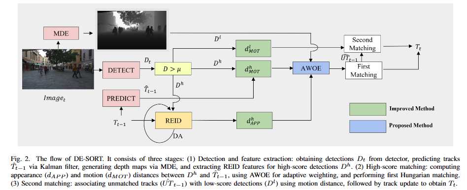
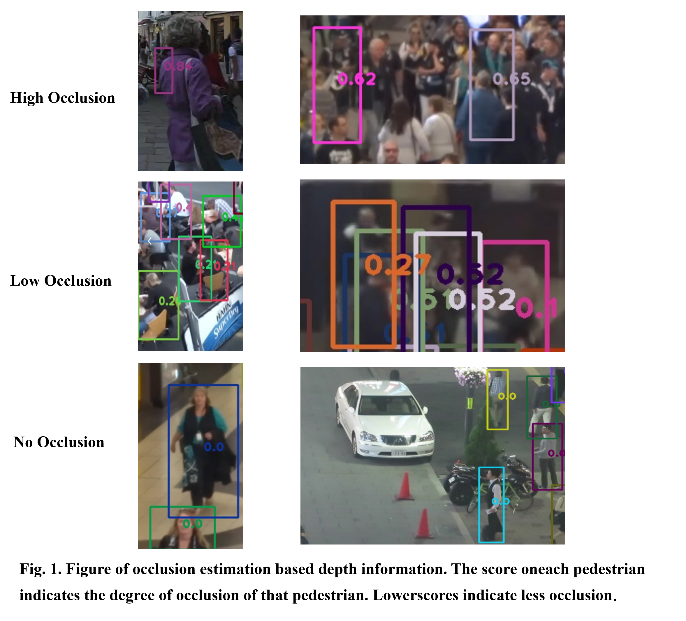

# DE-SORT
DE-SORT: Depth-enhanced SORT for Multi-Pedestrian Tracking

## Figure of Our DE-SORT

## Visualization Result
### Occlusion Estimation Visualization

### MOT17 Visualization Result

### MOT20 Visualization Result

### DanceTrack Visualization Results

### Comparison of de-sort and bot-sort on mot17

### Comparison of de-sort and bot-sort on mot17 and mot20

